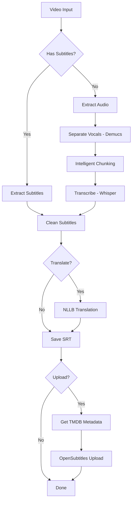

# 🏗️ Transcriber Pro - Architettura Tecnica

> **Documento per:** Developer, Contributor, Advanced Users  
> **Versione:** 1.0  
> **Ultima modifica:** Ottobre 2025

---

## 📑 Indice

- [Panoramica Architettura](#panoramica-architettura)
- [Stack Tecnologico](#stack-tecnologico)
- [Struttura Modulare](#struttura-modulare)
- [Flusso Dati](#flusso-dati)
- [Design Patterns](#design-patterns)
- [Pipeline Processing](#pipeline-processing)
- [Gestione Memoria](#gestione-memoria)
- [API Interna](#api-interna)
- [Estensibilità](#estensibilità)

---

## 🎯 Panoramica Architettura

### Principi di Design

**Transcriber Pro** è costruito seguendo questi principi:

1. **Modularità** - Componenti indipendenti e sostituibili
2. **Scalabilità** - Gestione efficiente risorse GPU/CPU
3. **Robustezza** - Gestione errori e fallback automatici
4. **Estensibilità** - Facile aggiunta nuove funzionalità
5. **Performance** - Ottimizzazione per hardware consumer

### Architettura High-Level

```
┌─────────────────────────────────────────────────────────┐
│                   PRESENTATION LAYER                     │
│                      (PyQt6 GUI)                        │
│  ┌──────────┐  ┌──────────┐  ┌──────────┐             │
│  │  Main    │  │ Resource │  │  Video   │             │
│  │  Window  │  │ Monitor  │  │  Preview │             │
│  └──────────┘  └──────────┘  └──────────┘             │
└────────────────────┬────────────────────────────────────┘
                     │ Signals/Slots
                     ▼
┌─────────────────────────────────────────────────────────┐
│                   BUSINESS LOGIC LAYER                   │
│                    (Core Processing)                     │
│  ┌─────────────────────────────────────────────────┐   │
│  │           ProcessingPipeline (Orchestrator)     │   │
│  └─────────────────────────────────────────────────┘   │
│         │         │          │           │             │
│    ┌────▼───┐ ┌──▼────┐ ┌───▼─────┐ ┌──▼──────┐       │
│    │Subtitle│ │Audio  │ │Transcr- │ │Transl-  │       │
│    │Extract │ │Process│ │iber     │ │ator     │       │
│    └────────┘ └───────┘ └─────────┘ └─────────┘       │
└────────────────────┬────────────────────────────────────┘
                     │
                     ▼
┌─────────────────────────────────────────────────────────┐
│                   DATA ACCESS LAYER                      │
│                   (Utils & Clients)                      │
│  ┌──────────┐  ┌──────────┐  ┌──────────┐             │
│  │  TMDB    │  │  IMDb    │  │OpenSubs  │             │
│  │  Client  │  │  Client  │  │  Client  │             │
│  └──────────┘  └──────────┘  └──────────┘             │
└─────────────────────────────────────────────────────────┘
                     │
                     ▼
┌─────────────────────────────────────────────────────────┐
│                   AI MODELS LAYER                        │
│  ┌──────────────┐  ┌──────────────┐  ┌──────────────┐ │
│  │  Faster-     │  │    NLLB      │  │   Demucs     │ │
│  │  Whisper     │  │    200       │  │  htdemucs    │ │
│  │  (1.5B)      │  │   (3.3B)     │  │              │ │
│  └──────────────┘  └──────────────┘  └──────────────┘ │
└─────────────────────────────────────────────────────────┘
```

---

## 💻 Stack Tecnologico

### Core Technologies

| Layer | Technology | Version | Purpose |
|-------|-----------|---------|---------|
| **GUI** | PyQt6 | 6.6+ | Interfaccia grafica moderna |
| **AI/ML** | PyTorch | 2.1+ | Framework deep learning |
| **Transcription** | Faster-Whisper | 1.0+ | Speech-to-text optimized |
| **Translation** | NLLB-200 | 3.3B | Neural translation (Meta) |
| **Audio Sep** | Demucs | 4.0+ | Source separation (Meta) |
| **Video/Audio** | FFmpeg | 6.0+ | Multimedia framework |

### Dependencies Tree

```
transcriber-pro/
├── GUI Layer
│   ├── PyQt6 (UI framework)
│   ├── psutil (system monitoring)
│   └── pynvml (GPU monitoring)
│
├── AI/ML Layer
│   ├── torch (core framework)
│   ├── transformers (Hugging Face)
│   ├── faster-whisper (CTranslate2 backend)
│   └── demucs (audio separation)
│
├── Audio Processing
│   ├── torchaudio (audio I/O)
│   ├── librosa (analysis)
│   ├── soundfile (file handling)
│   └── pydub (conversion)
│
├── Subtitle Processing
│   ├── pysrt (SRT parsing)
│   └── chardet (encoding detection)
│
└── External APIs
    ├── requests (HTTP client)
    └── xmlrpc.client (OpenSubtitles)
```

---

## 📂 Struttura Modulare

### Directory Layout Dettagliato

```
transcriber-pro/
│
├── main.py                      # Entry point applicazione
│
├── gui/                         # Presentation Layer
│   ├── __init__.py
│   ├── main_window.py          # Finestra principale
│   ├── splash_screen.py        # Splash screen iniziale
│   ├── widgets.py              # Widget custom (ResourceMonitor, etc.)
│   └── workers.py              # QThread workers per processing
│
├── core/                        # Business Logic Layer
│   ├── __init__.py
│   ├── pipeline.py             # 🎯 Orchestratore principale
│   ├── transcriber.py          # Wrapper Faster-Whisper
│   ├── translator.py           # Wrapper NLLB-200
│   ├── audio_processor.py      # Demucs + chunking intelligente
│   ├── subtitle_extractor.py   # Estrazione sottotitoli embedded
│   ├── subtitle_cleaner.py     # Pulizia e normalizzazione
│   └── audio_track_selector.py # Selezione traccia audio ottimale
│
├── utils/                       # Data Access Layer
│   ├── __init__.py
│   ├── config.py               # Configuration manager (singleton)
│   ├── logger.py               # Logging system
│   ├── file_handler.py         # File operations
│   ├── resource_monitor.py     # System resource monitoring
│   ├── tmdb_client.py          # TMDB API client
│   ├── imdb_client.py          # IMDb web scraper
│   ├── opensubtitles_client.py # OpenSubtitles REST API
│   ├── opensubtitles_xmlrpc_uploader.py  # XML-RPC uploader
│   ├── opensubtitles_config.py # OpenSubtitles configuration
│   ├── subtitle_uploader_interface.py  # Uploader interface (ABC)
│   └── translations.py         # i18n support
│
├── scripts/                     # Utility scripts
│   ├── verify_opensubtitles_setup.py
│   └── test_imports.py
│
├── docs/                        # Documentation
│   ├── GUIDA_UTENTE.md
│   ├── GUIDA_INSTALLAZIONE.md
│   └── OPENSUBTITLES_README.md
│
└── tests/                       # Unit & Integration tests
    ├── test_pipeline.py
    ├── test_transcriber.py
    └── test_translator.py
```

### Moduli Core - Responsabilità

#### 1. **ProcessingPipeline** (`core/pipeline.py`)

**Responsabilità:** Orchestrazione workflow completo

**Metodi principali:**
```python
class ProcessingPipeline:
    def process(self) -> bool:
        """Entry point - esegue pipeline completo"""
        
    def _check_embedded_subtitles(self) -> bool:
        """STEP 1: Verifica sottotitoli embedded"""
        
    def _extract_subtitles(self) -> bool:
        """STEP 2a: Estrae sottotitoli se presenti"""
        
    def _transcribe_audio(self) -> bool:
        """STEP 2b: Trascrizione se no sottotitoli"""
        
    def _clean_subtitles(self) -> bool:
        """STEP 3: Pulizia sottotitoli"""
        
    def _smart_translate(self) -> bool:
        """STEP 4: Traduzione intelligente"""
        
    def _save_final(self) -> bool:
        """STEP 5: Salvataggio output"""
        
    def _upload_opensubtitles(self) -> bool:
        """STEP 6: Upload (opzionale)"""
```

**Pattern:** Template Method Pattern

---

#### 2. **Transcriber** (`core/transcriber.py`)

**Responsabilità:** Wrapper Faster-Whisper con gestione chunks

**Architettura:**
```python
class Transcriber:
    def __init__(self, method='faster-whisper'):
        self.device = "cuda" if torch.cuda.is_available() else "cpu"
        self.faster_whisper_model = None
        self._init_faster_whisper()
    
    def transcribe(self, audio_chunks, language=None) -> (bool, str):
        """Trascrizione chunks con VAD intelligente"""
        segments, detected_lang = self._transcribe_chunks_faster_whisper(...)
        return self._save_srt(segments, output_path)
    
    def _transcribe_chunks_faster_whisper(self, chunks, lang):
        """Trascrizione batch con progress tracking"""
        for chunk_path, start_time, end_time in chunks:
            segments = model.transcribe(chunk_path, language=lang, vad_filter=True)
            # Merge con offset temporale
```

**Features:**
- ✅ Auto-detect lingua (99 lingue)
- ✅ VAD (Voice Activity Detection)
- ✅ Beam search ottimizzato
- ✅ GPU/CPU auto-switch
- ✅ Fallback se VAD fallisce

---

#### 3. **AudioProcessor** (`core/audio_processor.py`)

**Responsabilità:** Separazione vocale + chunking intelligente

**Pipeline Intelligente:**
```python
class AudioProcessor:
    CHUNK_TARGET_DURATION = 20  # Target 20s chunks
    CHUNK_MIN_DURATION = 10
    CHUNK_MAX_DURATION = 25
    
    def separate_vocals(self, audio_path):
        """Pipeline intelligente basata su durata"""
        duration = self._get_duration(audio_path)
        
        if duration <= 300:  # ≤5 min
            return self._separate_fast_path(wav, sr)
        elif duration <= 5400:  # 5-90 min
            return self._separate_standard_path(wav, sr, duration)
        else:  # >90 min
            return self._separate_robust_path(wav, sr, duration)
    
    def chunk_audio_intelligent(self, vocals_path):
        """Chunking basato su silenzio"""
        silences = self._detect_silences(audio)
        chunks = self._create_chunks_at_silences(
            silences,
            target=self.CHUNK_TARGET_DURATION
        )
```

**Strategia Demucs:**

| Durata | Path | Metodo | VRAM | Velocità |
|--------|------|--------|------|----------|
| ≤5min | Fast | Direct processing | 8GB | 🔥🔥🔥 |
| 5-90min | Standard | Auto-split (25% overlap) | 6GB | 🔥🔥 |
| >90min | Robust | Manual chunks (5min+10s) | 4GB | 🔥 |

---

#### 4. **NLLBTranslator** (`core/translator.py`)

**Responsabilità:** Traduzione neurale batch

```python
class NLLBTranslator:
    def __init__(self, model_name="facebook/nllb-200-3.3B", batch_size=6):
        self.model = AutoModelForSeq2SeqLM.from_pretrained(model_name)
        self.tokenizer = AutoTokenizer.from_pretrained(model_name)
        self.translator = pipeline("translation", ...)
        
    def translate_srt_file(self, input_path, output_path, src_lang, tgt_lang):
        """Traduzione file SRT completo"""
        subtitles = self._parse_srt(content)
        
        # Batch processing
        for batch in chunks(subtitles, self.batch_size):
            translated = self.translator(
                [text for _, _, _, text in batch],
                src_lang=src_lang_nllb,
                tgt_lang=tgt_lang_nllb
            )
```

**Ottimizzazioni:**
- ✅ Batch processing (6-8 sub per volta)
- ✅ GPU FP16 acceleration
- ✅ Context preservation tra batch
- ✅ Unload automatico modello dopo uso

---

## 🔄 Flusso Dati

### Workflow Completo



### Data Flow per Trascrizione

```
video.mp4 (2h film)
    ↓
[FFmpeg] Extract audio
    ↓
video_raw.wav (1.4 GB, stereo, 48kHz)
    ↓
[Demucs] Vocal separation (Standard Path: auto-split)
    ↓
video_vocals.wav (700 MB, mono, 44.1kHz)
    ↓
[Silence Detection] Find pauses
    ↓
chunk_times = [(0, 18.3), (18.3, 35.7), ...]  # 120 chunks
    ↓
[Physical Split] Create WAV files
    ↓
chunk_001.wav, chunk_002.wav, ..., chunk_120.wav
    ↓
[Faster-Whisper] Transcribe each (parallel-capable)
    ↓
segments = [
    {'start': 0, 'end': 18.3, 'text': 'Hello world'},
    {'start': 18.3, 'end': 35.7, 'text': 'This is a test'},
    ...
]  # 450 segments totali
    ↓
[Merge & Format] Combine to SRT
    ↓
video_transcribed.srt (45 KB)
```

---

## 🎨 Design Patterns

### 1. Factory Pattern - Uploader

**File:** `utils/subtitle_uploader_interface.py`

```python
class SubtitleUploaderInterface(ABC):
    """Abstract base class per uploader"""
    
    @abstractmethod
    def authenticate(self, username, password) -> bool:
        pass
    
    @abstractmethod
    def upload(self, video_path, subtitle_path, metadata):
        pass

class UploaderFactory:
    _implementations = {}
    
    @classmethod
    def register_implementation(cls, name: str, uploader_class):
        """Registra nuova implementazione"""
        cls._implementations[name] = uploader_class
    
    @classmethod
    def create_uploader(cls, implementation: str, **kwargs):
        """Factory method"""
        if implementation not in cls._implementations:
            raise ValueError(f"Implementation {implementation} not available")
        return cls._implementations[implementation](**kwargs)

# Registrazione
UploaderFactory.register_implementation('xmlrpc', OpenSubtitlesXMLRPCUploader)
# Future: UploaderFactory.register_implementation('rest', OpenSubtitlesRESTUploader)

# Utilizzo
uploader = UploaderFactory.create_uploader('xmlrpc', username='...', password='...')
```

**Vantaggi:**
- ✅ Facile aggiunta nuove implementazioni
- ✅ Zero breaking changes
- ✅ Testing facilitato (mock uploader)

---

### 2. Singleton Pattern - Config

**File:** `utils/config.py`

```python
_config_instance = None

def get_config() -> Config:
    """Ottiene istanza singleton configurazione"""
    global _config_instance
    if _config_instance is None:
        _config_instance = Config()
    return _config_instance

class Config:
    def __init__(self):
        self.settings = {}
        self.load()
```

**Utilizzo:**
```python
# Ovunque nel codice
from utils.config import get_config

config = get_config()
use_gpu = config.get('use_gpu', True)
```

---

### 3. Observer Pattern - GUI Updates

**File:** `gui/workers.py` + `core/pipeline.py`

```python
# Worker thread (PyQt6)
class ProcessingWorker(QThread):
    progress = pyqtSignal(int)
    log_message = pyqtSignal(str)
    finished = pyqtSignal(bool)
    
    def run(self):
        pipeline = ProcessingPipeline(...)
        pipeline.set_log_callback(self.emit_log)
        success = pipeline.process()
        self.finished.emit(success)
    
    def emit_log(self, message: str):
        self.log_message.emit(message)

# Main Window
class MainWindow:
    def start_processing(self):
        self.worker = ProcessingWorker(...)
        self.worker.log_message.connect(self.append_log)
        self.worker.progress.connect(self.update_progress)
        self.worker.start()
```

---

### 4. Strategy Pattern - Transcription Methods

```python
class Transcriber:
    def __init__(self, method='faster-whisper'):
        self.method = method
        if method == 'faster-whisper':
            self._init_faster_whisper()
        # Future: elif method == 'whisper-base': ...
    
    def transcribe(self, **kwargs):
        if self.method == 'faster-whisper':
            return self._transcribe_faster_whisper(**kwargs)
        # Future strategies: whisper-base, whisper-small, etc.
```

---

## 🧠 Gestione Memoria

### GPU Memory Management

**Strategia VRAM:**

```python
# core/pipeline.py - Memory Swapping

# STEP 1: Demucs caricato
audio_processor.separate_vocals(...)  # ~4GB VRAM

# Cleanup Demucs
audio_processor.cleanup_model()
del audio_processor
if torch.cuda.is_available():
    torch.cuda.empty_cache()  # Libera VRAM

# STEP 2: Whisper caricato
transcriber = Transcriber()  # ~5GB VRAM
transcriber.transcribe(...)

# Cleanup Whisper
transcriber.cleanup()
if torch.cuda.is_available():
    torch.cuda.empty_cache()

# STEP 3: NLLB caricato
translator = NLLBTranslator()  # ~7GB VRAM
translator.translate_srt_file(...)

# Cleanup NLLB
translator.unload_model()
if torch.cuda.is_available():
    torch.cuda.empty_cache()
```

**Timeline VRAM (RTX 3060 12GB):**
```
0─────────5─────────10────────15min
│ Demucs  │ Whisper │   NLLB   │
├─────────┤         │          │
│  4GB    │   5GB   │   7GB    │
│ ✓ Free  │ ✓ Free  │ ✓ Free   │
└─────────┴─────────┴──────────┘
```

---

### Fallback Strategy

```python
try:
    # Prova GPU
    model.to('cuda')
    output = model(input.cuda())
except RuntimeError as e:
    if "out of memory" in str(e).lower():
        # Fallback CPU
        torch.cuda.empty_cache()
        model.to('cpu')
        output = model(input.cpu())
        logger.warning("GPU OOM - Fallback CPU")
```

---

## 🔌 API Interna

### Core API - ProcessingPipeline

```python
from core.pipeline import ProcessingPipeline

# Inizializzazione
pipeline = ProcessingPipeline(
    video_path="/path/to/video.mp4",
    config=config_instance
)

# Set callback per log GUI
def log_callback(message: str):
    print(f"[LOG] {message}")

pipeline.set_log_callback(log_callback)

# Esecuzione
success = pipeline.process()

if success:
    print(f"Subtitle salvato: {pipeline.final_srt}")
else:
    print("Elaborazione fallita")
```

---

### Utils API - TMDB Client

```python
from utils.tmdb_client import get_tmdb_client

# Singleton client
client = get_tmdb_client()

# Ricerca film
result = client.search_movie("The Matrix", year=1999)
if result:
    print(f"Title: {result['title']}")
    print(f"IMDb ID: {result.get('imdb_id')}")
    print(f"Year: {result['release_date'][:4]}")
```

---

### Utils API - OpenSubtitles Upload

```python
from utils.subtitle_uploader_interface import UploaderFactory, SubtitleMetadata

# Crea uploader
uploader = UploaderFactory.create_uploader(
    'xmlrpc',
    username='my_username',
    password='my_password'
)

# Metadata
metadata = SubtitleMetadata(
    imdb_id='tt0133093',
    language_code='ita',
    release_name='The.Matrix.1999.1080p.BluRay.x264'
)

# Upload
success, url = uploader.upload(
    video_path='/path/to/video.mp4',
    subtitle_path='/path/to/video.it.srt',
    metadata=metadata
)

if success:
    print(f"Uploaded: {url}")
```

---

## 🔧 Estensibilità

### Come Aggiungere Nuove Features

#### 1. Nuovo Modello Trascrizione

**File da modificare:** `core/transcriber.py`

```python
class Transcriber:
    SUPPORTED_METHODS = ['faster-whisper', 'whisper-base', 'whisper-small']
    
    def __init__(self, method='faster-whisper'):
        self.method = method
        
        if method == 'faster-whisper':
            self._init_faster_whisper()
        elif method == 'whisper-base':
            self._init_whisper_base()  # NEW
        elif method == 'whisper-small':
            self._init_whisper_small()  # NEW
    
    def _init_whisper_base(self):
        """Inizializza Whisper base model (più veloce, meno accurato)"""
        from faster_whisper import WhisperModel
        self.model = WhisperModel("base", device=self.device)
```

---

#### 2. Nuova Lingua Output

**File da modificare:** `core/translator.py`

```python
class NLLBTranslator:
    # Aggiungi mapping
    LANGUAGE_CODES = {
        ...
        'ita': 'ita_Latn',
        'eng': 'eng_Latn',
        'fra': 'fra_Latn',  # NEW
        'spa': 'spa_Latn',  # NEW
    }
```

**File da modificare:** `utils/config.py`

```json
{
  "language": "fra",  # Invece di "ita"
  ...
}
```

---

#### 3. Nuovo Uploader (REST API futura)

**Step 1:** Crea implementazione

```python
# File: utils/opensubtitles_rest_uploader.py

from utils.subtitle_uploader_interface import SubtitleUploaderInterface

class OpenSubtitlesRESTUploader(SubtitleUploaderInterface):
    def __init__(self, api_key: str, **kwargs):
        self.api_key = api_key
        self.base_url = "https://api.opensubtitles.com"
    
    def authenticate(self, username, password):
        # JWT authentication
        response = requests.post(
            f"{self.base_url}/auth/login",
            json={"username": username, "password": password}
        )
        self.token = response.json()['token']
        return True
    
    def upload(self, video_path, subtitle_path, metadata):
        # REST API upload
        headers = {"Authorization": f"Bearer {self.token}"}
        # ... implementazione REST
```

**Step 2:** Registra factory

```python
# File: utils/opensubtitles_rest_uploader.py (in fondo)

from utils.subtitle_uploader_interface import UploaderFactory
UploaderFactory.register_implementation('rest', OpenSubtitlesRESTUploader)
```

**Step 3:** Usa

```python
# ZERO BREAKING CHANGES!
uploader = UploaderFactory.create_uploader('rest', api_key='....')
```

---

## 📊 Performance Benchmarks

### Hardware Testato

**Sistema di riferimento:**
- CPU: Intel i7-12700KF (12 core, 20 thread)
- RAM: 12 GB DDR4
- GPU: NVIDIA RTX 3060 12GB VRAM
- Storage: SSD NVMe

### Tempi di Elaborazione

| Video | Durata | GPU Time | CPU Time | Speedup |
|-------|--------|----------|----------|---------|
| Short clip | 5 min | 45 sec | 7 min | 9.3x |
| TV Episode | 45 min | 7 min | 67 min | 9.5x |
| Movie | 2h 15min | 20 min | 3h 22min | 10.1x |
| Long doc | 4h | 38 min | 6h 12min | 9.8x |

**Media:** ~10x speedup GPU vs CPU

---

## 🚀 Roadmap Tecnico

### v1.1 (Pianificato)

- [ ] Supporto macOS (MPS backend PyTorch)
- [ ] Whisper model selector (base/small/medium/large)
- [ ] Parallel chunk processing (multi-GPU)
- [ ] API REST per uso remoto

### v1.2 (Futuro)

- [ ] Docker containerization
- [ ] Cloud processing (AWS/Azure)
- [ ] Real-time transcription (streaming)
- [ ] Plugin system per estensioni

---

## 📚 Riferimenti

**Papers:**
- Whisper: [Robust Speech Recognition via Large-Scale Weak Supervision](https://arxiv.org/abs/2212.04356)
- NLLB: [No Language Left Behind](https://arxiv.org/abs/2207.04672)
- Demucs: [Hybrid Spectrogram and Waveform Source Separation](https://arxiv.org/abs/2111.03600)

**Libraries:**
- [Faster-Whisper](https://github.com/guillaumekln/faster-whisper)
- [Transformers (Hugging Face)](https://huggingface.co/docs/transformers)
- [Demucs](https://github.com/facebookresearch/demucs)
- [PyQt6](https://www.riverbankcomputing.com/software/pyqt/)

---

<div align="center">

**Contribuisci al progetto! 🚀**

*Pull requests welcome - Vedi CONTRIBUTING.md*

</div>
