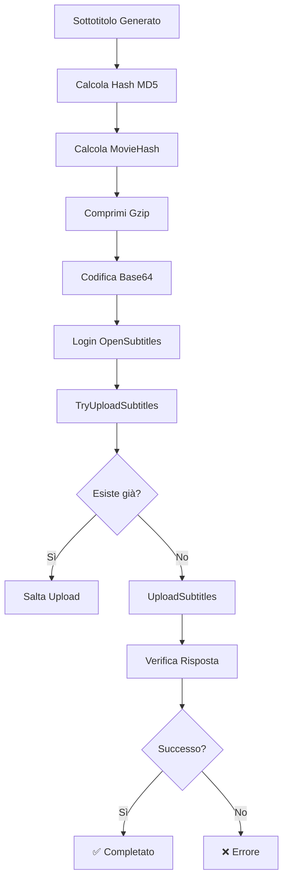

# 🎬 OpenSubtitles Integration - IA Transcriber Pro

## 📖 Indice

- [Panoramica](#panoramica)
- [Prerequisiti](#prerequisiti)
- [Configurazione](#configurazione)
- [Utilizzo](#utilizzo)
- [Architettura Tecnica](#architettura-tecnica)
- [API OpenSubtitles](#api-opensubtitles)
- [Troubleshooting](#troubleshooting)
- [FAQ](#faq)
- [Riferimenti](#riferimenti)

---

## 🌟 Panoramica

L'integrazione OpenSubtitles permette di caricare automaticamente i sottotitoli generati da IA Transcriber Pro sul database di [OpenSubtitles.org](https://www.opensubtitles.org/), il più grande repository di sottotitoli al mondo.

### Caratteristiche Principali

- ✅ **Upload automatico** dopo la trascrizione
- ✅ **Verifica duplicati** prima dell'upload
- ✅ **Matching video intelligente** tramite moviehash
- ✅ **Supporto multi-lingua** (ISO 639-2)
- ✅ **Metadata IMDB** automatici
- ✅ **Log dettagliati** per debug

---

## 🔑 Prerequisiti

### 1. Account OpenSubtitles

Registrati su [opensubtitles.com](https://www.opensubtitles.com/):

1. Crea un account gratuito
2. Verifica la tua email
3. Annota username e password

### 2. User Agent Registrato

**IMPORTANTE**: L'API OpenSubtitles richiede un User Agent registrato.

Per ottenerne uno:
1. Vai su [forum.opensubtitles.org](https://forum.opensubtitles.org/)
2. Contatta gli amministratori
3. Richiedi un User Agent per la tua applicazione
4. Formato suggerito: `NomeApp v1.0`

> ⚠️ **Nota**: L'uso di User Agent non registrati può portare al ban dell'IP.

### 3. Limiti API

**Account Gratuito:**
- 📥 Download: 20 sottotitoli/giorno
- 📤 Upload: 10 sottotitoli/giorno
- ⏱️ Rate limit: 40 richieste/10 secondi

**Account VIP:**
- 📥 Download: 1000 sottotitoli/giorno
- 📤 Upload illimitati
- 🚀 Priorità nelle richieste

---

## ⚙️ Configurazione

### 1. File di Configurazione

Modifica `config/settings.json`:

```json
{
  "opensubtitles": {
    "enabled": true,
    "username": "tuo_username",
    "password": "tua_password",
    "user_agent": "IaTranscriberPro v1.0",
    "auto_upload": true,
    "force_upload": false,
    "default_language": "ita"
  }
}
```

### 2. Parametri Spiegati

| Parametro | Tipo | Default | Descrizione |
|-----------|------|---------|-------------|
| `enabled` | boolean | `false` | Abilita/disabilita l'integrazione |
| `username` | string | `""` | Username OpenSubtitles |
| `password` | string | `""` | Password OpenSubtitles |
| `user_agent` | string | `""` | User Agent registrato |
| `auto_upload` | boolean | `true` | Upload automatico dopo trascrizione |
| `force_upload` | boolean | `false` | Upload anche se sottotitoli esistono già |
| `default_language` | string | `"ita"` | Codice lingua ISO 639-2 di default |

### 3. Variabili d'Ambiente (Opzionale)

Per maggiore sicurezza, usa variabili d'ambiente:

```bash
# Windows
set OPENSUBTITLES_USERNAME=tuo_username
set OPENSUBTITLES_PASSWORD=tua_password
set OPENSUBTITLES_USER_AGENT=IaTranscriberPro v1.0

# Linux/Mac
export OPENSUBTITLES_USERNAME=tuo_username
export OPENSUBTITLES_PASSWORD=tua_password
export OPENSUBTITLES_USER_AGENT="IaTranscriberPro v1.0"
```

---

## 🚀 Utilizzo

### Upload Automatico

1. **Abilita OpenSubtitles** nelle impostazioni
2. **Elabora un video** normalmente
3. L'upload avviene **automaticamente** al completamento

```
📹 Elaborazione video: film.mkv
🎯 Trascrizione completata
💾 Salvataggio: film.it.srt
📤 Upload OpenSubtitles in corso...
✅ Upload completato!
🔗 URL: https://www.opensubtitles.org/subtitles/123456
```

### Upload Manuale

Usa il metodo `upload_subtitle()` direttamente:

```python
from utils.opensubtitles_client import get_opensubtitles_client
from utils.opensubtitles_xmlrpc_uploader import OpenSubtitlesXMLRPC

# Inizializza client
uploader = OpenSubtitlesXMLRPC(
    username="tuo_username",
    password="tua_password",
    user_agent="IaTranscriberPro v1.0"
)

client = get_opensubtitles_client(uploader)

# Upload sottotitolo
success, result = client.upload_subtitle(
    subtitle_path=Path("film.it.srt"),
    video_path=Path("film.mkv"),
    imdb_id="tt1234567",  # Opzionale ma raccomandato
    force=False
)

if success:
    print(f"✅ Upload riuscito: {result}")
else:
    print(f"❌ Errore: {result}")
```

### Convenzioni Nome File

Il codice lingua viene estratto automaticamente dal nome file:

| Nome File | Lingua Rilevata |
|-----------|-----------------|
| `film.it.srt` | Italiano (ita) |
| `film.ita.srt` | Italiano (ita) |
| `movie.en.srt` | Inglese (eng) |
| `movie.eng.srt` | Inglese (eng) |
| `video.es.srt` | Spagnolo (spa) |
| `video.fr.srt` | Francese (fre) |
| `video.de.srt` | Tedesco (ger) |

**Formato consigliato**: `nome_video.LINGUA.srt`

---

## 🏗️ Architettura Tecnica

### Struttura dei File

```
utils/
├── opensubtitles_client.py          # Client principale
├── opensubtitles_xmlrpc_uploader.py # Gestione XML-RPC
└── opensubtitles_hash.py            # Calcolo moviehash

core/
└── pipeline.py                       # Integrazione nella pipeline
```

### Flusso di Upload



### Componenti Principali

#### 1. OpenSubtitlesClient

Classe principale che gestisce l'upload:

```python
class OpenSubtitlesClient:
    def upload_subtitle(self, subtitle_path, video_path, force, imdb_id)
    def _calculate_subtitle_hash(self, subtitle_path)
```

**Responsabilità:**
- Calcolo hash sottotitolo (MD5)
- Preparazione dati per API
- Compressione e encoding contenuto
- Gestione errori e retry

#### 2. OpenSubtitlesXMLRPC

Gestione comunicazione XML-RPC:

```python
class OpenSubtitlesXMLRPC:
    def login(self)
    def logout(self)
    def calculate_movie_hash(self, filepath)
```

**Responsabilità:**
- Autenticazione
- Calcolo moviehash
- Chiamate XML-RPC raw

#### 3. MovieHash Calculator

Algoritmo hash OpenSubtitles:

```python
def calculate_movie_hash(filepath: str) -> str:
    # Hash = dimensione + checksum primi 64KB + checksum ultimi 64KB
    return hash_hex
```

---

## 🔧 API OpenSubtitles

### Endpoint XML-RPC

**Base URL**: `https://api.opensubtitles.org/xml-rpc`

### Metodi Utilizzati

#### 1. LogIn

Autenticazione e ottenimento token:

```python
response = server.LogIn(username, password, language, user_agent)
token = response['token']
```

**Parametri:**
- `username`: Username OpenSubtitles
- `password`: Password (può essere hash MD5)
- `language`: Codice lingua (es: 'en', 'it')
- `user_agent`: User Agent registrato

**Risposta:**
```python
{
    'status': '200 OK',
    'token': 'abc123def456...',
    'seconds': 0.123
}
```

#### 2. TryUploadSubtitles

Verifica preliminare prima dell'upload:

```python
try_data = {
    'cd1': {
        'subhash': 'md5_hash_32_chars',
        'subfilename': 'film.it.srt',
        'moviehash': 'opensubtitles_hash',
        'moviebytesize': '1234567890',
        'moviefilename': 'film.mkv'
    }
}

response = server.TryUploadSubtitles(token, try_data)
```

**Risposta:**
```python
{
    'status': '200 OK',
    'alreadyindb': 0,  # 0 = nuovo, 1 = esiste già
    'data': {...}      # Info film se trovato
}
```

#### 3. UploadSubtitles

Upload effettivo dei sottotitoli:

```python
upload_data = {
    'baseinfo': {
        'idmovieimdb': '1234567',         # Senza 'tt'
        'sublanguageid': 'ita',           # ISO 639-2
        'moviereleasename': 'Film.1080p.BluRay',
        'movieaka': '',                    # Opzionale
        'subauthorcomment': ''             # Opzionale
    },
    'cd1': {
        'subhash': 'md5_hash',            # MD5 sottotitolo
        'subfilename': 'film.it.srt',
        'moviehash': 'os_hash',           # Hash OpenSubtitles
        'moviebytesize': '1234567890',    # Come stringa
        'moviefilename': 'film.mkv',
        'subcontent': 'base64_gzip_data', # Gzip + Base64
        'movietimems': '',                 # Opzionale
        'moviefps': '',                    # Opzionale
        'movieframes': ''                  # Opzionale
    }
}

response = server.UploadSubtitles(token, upload_data)
```

**Risposta Successo:**
```python
{
    'status': '200 OK',
    'data': 'https://www.opensubtitles.org/subtitles/123456',
    'seconds': 1.234
}
```

**Risposta Errore:**
```python
{
    'status': '412 Precondition Failed',
    'seconds': 0.1
}
```

### Struttura Dati Critica

#### baseinfo (Informazioni Generali)

| Campo | Tipo | Obbligatorio | Descrizione |
|-------|------|--------------|-------------|
| `idmovieimdb` | string | Raccomandato | ID IMDB senza 'tt' (es: '1234567') |
| `sublanguageid` | string | **Sì** | Codice ISO 639-2 (es: 'ita', 'eng') |
| `moviereleasename` | string | Raccomandato | Nome release video |
| `movieaka` | string | No | Titolo alternativo |
| `subauthorcomment` | string | No | Commento uploader |

#### cd1 (Dati File)

| Campo | Tipo | Obbligatorio | Descrizione |
|-------|------|--------------|-------------|
| `subhash` | string | **Sì** | MD5 file sottotitolo (32 hex) |
| `subfilename` | string | **Sì** | Nome file sottotitolo |
| `moviehash` | string | **Sì** | Hash OpenSubtitles video (16 hex) |
| `moviebytesize` | string | **Sì** | Dimensione video in bytes |
| `moviefilename` | string | **Sì** | Nome file video |
| `subcontent` | string | **Sì** | Contenuto gzip + base64 |
| `movietimems` | string | No | Durata in millisecondi |
| `moviefps` | string | No | Frame per secondo |
| `movieframes` | string | No | Numero totale frame |

### Algoritmi Critici

#### 1. MovieHash OpenSubtitles

```python
def calculate_movie_hash(filepath):
    """
    Hash OpenSubtitles: dimensione + checksum 64KB inizio + checksum 64KB fine
    """
    filesize = os.path.getsize(filepath)
    hash_value = filesize
    
    with open(filepath, 'rb') as f:
        # Primi 64KB
        for _ in range(65536 // 8):
            buffer = f.read(8)
            hash_value += struct.unpack('<Q', buffer)[0]
            hash_value &= 0xFFFFFFFFFFFFFFFF
        
        # Ultimi 64KB
        f.seek(max(0, filesize - 65536))
        for _ in range(65536 // 8):
            buffer = f.read(8)
            hash_value += struct.unpack('<Q', buffer)[0]
            hash_value &= 0xFFFFFFFFFFFFFFFF
    
    return '%016x' % hash_value
```

**Caratteristiche:**
- ⚡ Molto veloce (legge solo 128KB)
- 🎯 Preciso per stesso file video
- 📦 Dimensione file + checksum inizio/fine

#### 2. SubHash (MD5)

```python
def calculate_subtitle_hash(filepath):
    """Hash MD5 completo del file sottotitolo"""
    md5 = hashlib.md5()
    with open(filepath, 'rb') as f:
        for chunk in iter(lambda: f.read(8192), b''):
            md5.update(chunk)
    return md5.hexdigest()  # 32 caratteri hex
```

#### 3. SubContent (Gzip + Base64)

```python
def prepare_subcontent(filepath):
    """
    Prepara contenuto per upload:
    1. Leggi file
    2. Comprimi con gzip SENZA header
    3. Codifica in base64
    """
    with open(filepath, 'rb') as f:
        content = f.read()
    
    # Comprimi con zlib (gzip senza header)
    compressed = zlib.compress(content)[2:-4]  # Rimuove header/footer
    
    # Codifica base64
    encoded = base64.b64encode(compressed).decode('ascii')
    
    return encoded
```

**IMPORTANTE**: 
- ❌ **NON** usare `gzip.compress()` (include header)
- ✅ **USA** `zlib.compress()[2:-4]` (senza header)
- ✅ Poi `base64.b64encode()`

---

## 🔍 Troubleshooting

### Errori Comuni

#### 1. "401 Unauthorized"

**Causa**: Credenziali errate o token scaduto

**Soluzione**:
```python
# Verifica username/password
# Controlla che User Agent sia registrato
# Rieffettua login
```

#### 2. "412 Precondition Failed - subhash has invalid format"

**Causa**: Hash MD5 sottotitolo non valido

**Soluzione**:
- ✅ Verifica che `subhash` sia esattamente 32 caratteri esadecimali
- ✅ Controlla che il file sottotitolo esista e sia leggibile
- ✅ Rimuovi caratteri non esadecimali (0-9, a-f)

```python
# Test hash
import hashlib
with open('subtitle.srt', 'rb') as f:
    hash_val = hashlib.md5(f.read()).hexdigest()
    print(f"Hash length: {len(hash_val)}")  # Deve essere 32
    print(f"Hash: {hash_val}")
```

#### 3. "402 Invalid Format - subcontent"

**Causa**: Contenuto non compresso correttamente o non in base64

**Soluzione**:
- ❌ Non usare `gzip.compress()` direttamente
- ✅ Usa `zlib.compress()[2:-4]` per rimuovere header
- ✅ Verifica che il base64 sia valido

```python
import zlib
import base64

# Corretto
with open('subtitle.srt', 'rb') as f:
    content = f.read()
compressed = zlib.compress(content)[2:-4]
encoded = base64.b64encode(compressed).decode('ascii')
```

#### 4. "406 No Session"

**Causa**: Token sessione scaduto o non valido

**Soluzione**:
```python
# Rieffettua login
uploader.login()
```

#### 5. "503 Service Unavailable"

**Causa**: Server OpenSubtitles sovraccarico

**Soluzione**:
- ⏱️ Attendi qualche minuto
- 🔄 Riprova con exponential backoff
- 📊 Controlla status server: [status.opensubtitles.org](https://status.opensubtitles.org)

#### 6. "429 Too Many Requests"

**Causa**: Rate limit superato (40 req/10sec)

**Soluzione**:
```python
import time

# Aggiungi delay tra richieste
time.sleep(0.5)  # 500ms tra richieste
```

### Debug Avanzato

#### Abilita Logging Dettagliato

```python
import logging

# Configura logging
logging.basicConfig(
    level=logging.DEBUG,
    format='%(asctime)s - %(name)s - %(levelname)s - %(message)s'
)

logger = logging.getLogger('opensubtitles')
logger.setLevel(logging.DEBUG)
```

#### Verifica Risposta Raw

```python
# Vedi risposta completa del server
response = server.UploadSubtitles(token, data)
print(f"Status: {response.get('status')}")
print(f"Full response: {response}")
```

#### Test Connessione

```python
# Test base
import xmlrpc.client

server = xmlrpc.client.ServerProxy(
    'https://api.opensubtitles.org/xml-rpc',
    verbose=True  # Mostra comunicazione raw
)

# Test ServerInfo
info = server.ServerInfo()
print(f"Server version: {info}")
```

---

## ❓ FAQ

### Q: Posso usare l'API senza registrare User Agent?

**A**: No. L'uso di User Agent non registrati può portare al ban permanente dell'IP. Contatta sempre gli amministratori per registrare il tuo User Agent.

### Q: Quanto costa l'API?

**A**: L'API è **gratuita** per uso personale con limiti:
- 20 download/giorno
- 10 upload/giorno
- Account VIP disponibili per uso intensivo

### Q: Posso caricare sottotitoli già esistenti?

**A**: Sì, usa `force=True` nel metodo `upload_subtitle()`. Tuttavia, cerca sempre di **evitare duplicati** inutili.

### Q: Come ottengo l'IMDB ID di un film?

**A**: 
1. Cerca il film su [imdb.com](https://www.imdb.com)
2. L'ID è nell'URL: `https://www.imdb.com/title/tt1234567/`
3. Usa `tt1234567` o solo `1234567`

### Q: Posso caricare sottotitoli per CD multipli?

**A**: Sì, aggiungi `cd2`, `cd3`, ecc. nella struttura dati:

```python
upload_data = {
    'baseinfo': {...},
    'cd1': {...},
    'cd2': {...},  # Secondo CD
}
```

### Q: L'upload è permanente?

**A**: Sì, una volta caricati i sottotitoli diventano pubblici e permanenti. Assicurati della qualità prima dell'upload.

### Q: Posso modificare sottotitoli già caricati?

**A**: No direttamente tramite API. Devi:
1. Accedere al sito web
2. Cercare i tuoi sottotitoli
3. Usare le funzioni di modifica del sito

### Q: Cosa succede se carico sottotitoli di bassa qualità?

**A**: Possibile **ban** dell'account. Assicurati che:
- ✅ Sincronizzazione sia corretta
- ✅ Lingua sia accurata
- ✅ Non ci siano errori grossolani
- ✅ Formato sia valido

### Q: L'API supporta file .sub/.ass/altri formati?

**A**: L'API accetta qualsiasi formato binario, ma **consigliato**: `.srt` (SubRip) per compatibilità massima.

---

## 📚 Riferimenti

### Documentazione Ufficiale

- **API XML-RPC**: [trac.opensubtitles.org/projects/opensubtitles/wiki/XMLRPC](https://trac.opensubtitles.org/projects/opensubtitles/wiki/XMLRPC)
- **REST API** (nuova): [opensubtitles.stoplight.io](https://opensubtitles.stoplight.io/docs/opensubtitles-api/)
- **Forum**: [forum.opensubtitles.org](https://forum.opensubtitles.org/)
- **Status Server**: [status.opensubtitles.org](https://status.opensubtitles.org/)

### Codici Lingua ISO 639-2

| Lingua | Codice | Lingua | Codice |
|--------|--------|--------|--------|
| Italiano | `ita` | Inglese | `eng` |
| Spagnolo | `spa` | Francese | `fre` |
| Tedesco | `ger` | Portoghese | `por` |
| Russo | `rus` | Cinese | `chi` |
| Giapponese | `jpn` | Coreano | `kor` |

[Lista completa ISO 639-2](https://www.loc.gov/standards/iso639-2/php/code_list.php)

### Esempi di Codice

Repository con implementazioni:
- **Python**: [github.com/agonzalezro/python-opensubtitles](https://github.com/agonzalezro/python-opensubtitles)
- **Node.js**: [github.com/vankasteelj/opensubtitles-api](https://github.com/vankasteelj/opensubtitles-api)
- **Go**: [github.com/oz/osdb](https://github.com/oz/osdb)

### Hash Implementations

- **Python**: [github.com/r-salas/oshash](https://github.com/r-salas/oshash)
- **Go**: [github.com/opensubtitlescli/moviehash](https://github.com/opensubtitlescli/moviehash)
- **Tutti i linguaggi**: [trac.opensubtitles.org/projects/opensubtitles/wiki/HashSourceCodes](https://trac.opensubtitles.org/projects/opensubtitles/wiki/HashSourceCodes)

---

## 📝 Note Finali

### Best Practices

1. ✅ **Sempre testare** su file piccoli prima di upload massivi
2. ✅ **Verificare qualità** dei sottotitoli prima dell'upload
3. ✅ **Rispettare rate limits** (40 req/10sec)
4. ✅ **Includere IMDB ID** quando possibile
5. ✅ **Usare nomi release accurati** per migliore matching
6. ✅ **Loggare sempre** le operazioni per debug
7. ✅ **Gestire errori** con retry e exponential backoff

### Considerazioni Etiche

- 🎯 Carica solo sottotitoli di **alta qualità**
- 📝 Rispetta i **diritti d'autore**
- 🌍 Contribuisci alla **comunità** open source
- ⚖️ Non abusare del servizio gratuito
- 🤝 Supporta il progetto diventando **VIP** se usi intensivamente

### Supporto

Per problemi o domande:

1. **Issues GitHub**: [github.com/tuorepo/issues](https://github.com/)
2. **Forum OpenSubtitles**: [forum.opensubtitles.org](https://forum.opensubtitles.org/)
3. **Email Supporto**: support@opensubtitles.org

---

## 📄 Licenza

Questo modulo è parte di **IA Transcriber Pro** ed è rilasciato sotto licenza MIT.

OpenSubtitles® è un marchio registrato di OpenSubtitles.org.

---

**Versione Documento**: 1.0.0  
**Ultimo Aggiornamento**: Ottobre 2025  
**Autore**: Francesco - IA Transcriber Pro Team

---

## 🎉 Contributi

Contributi benvenuti! Per migliorare questa documentazione:

1. Fork del repository
2. Crea branch feature (`git checkout -b feature/docs-improvement`)
3. Commit modifiche (`git commit -am 'Migliorata documentazione'`)
4. Push branch (`git push origin feature/docs-improvement`)
5. Apri Pull Request

---

**Made with ❤️ for the subtitle community**
