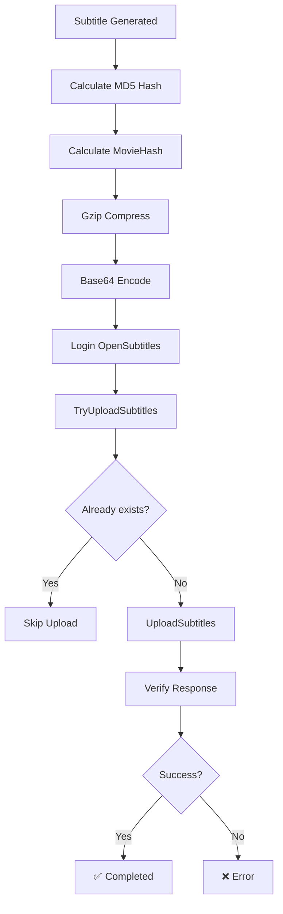

# 🎬 OpenSubtitles Integration - IA Transcriber Pro

## 📖 Table of Contents

- [Overview](#overview)
- [Prerequisites](#prerequisites)
- [Configuration](#configuration)
- [Usage](#usage)
- [Technical Architecture](#technical-architecture)
- [OpenSubtitles API](#opensubtitles-api)
- [Troubleshooting](#troubleshooting)
- [FAQ](#faq)
- [References](#references)

---

## 🌟 Overview

The OpenSubtitles integration allows you to automatically upload subtitles generated by IA Transcriber Pro to the [OpenSubtitles.org](https://www.opensubtitles.org/) database, the world's largest subtitle repository.

### Main Features

- ✅ **Automatic upload** after transcription
- ✅ **Duplicate verification** before upload
- ✅ **Intelligent video matching** via moviehash
- ✅ **Multi-language support** (ISO 639-2)
- ✅ **Automatic IMDB metadata**
- ✅ **Detailed logging** for debugging

---

## 🔑 Prerequisites

### 1. OpenSubtitles Account

Register on [opensubtitles.com](https://www.opensubtitles.com/):

1. Create a free account
2. Verify your email
3. Note down your username and password

### 2. Registered User Agent

**IMPORTANT**: The OpenSubtitles API requires a registered User Agent.

To obtain one:
1. Go to [forum.opensubtitles.org](https://forum.opensubtitles.org/)
2. Contact the administrators
3. Request a User Agent for your application
4. Suggested format: `AppName v1.0`

> ⚠️ **Note**: Using unregistered User Agents may lead to IP bans.

### 3. API Limits

**Free Account:**
- 📥 Downloads: 20 subtitles/day
- 📤 Uploads: 10 subtitles/day
- ⏱️ Rate limit: 40 requests/10 seconds

**VIP Account:**
- 📥 Downloads: 1000 subtitles/day
- 📤 Unlimited uploads
- 🚀 Request priority

---

## ⚙️ Configuration

### 1. Configuration File

Edit `config/settings.json`:

```json
{
  "opensubtitles": {
    "enabled": true,
    "username": "your_username",
    "password": "your_password",
    "user_agent": "IaTranscriberPro v1.0",
    "auto_upload": true,
    "force_upload": false,
    "default_language": "eng"
  }
}
```

### 2. Parameters Explained

| Parameter | Type | Default | Description |
|-----------|------|---------|-------------|
| `enabled` | boolean | `false` | Enable/disable integration |
| `username` | string | `""` | OpenSubtitles username |
| `password` | string | `""` | OpenSubtitles password |
| `user_agent` | string | `""` | Registered User Agent |
| `auto_upload` | boolean | `true` | Auto-upload after transcription |
| `force_upload` | boolean | `false` | Upload even if subtitles already exist |
| `default_language` | string | `"eng"` | Default ISO 639-2 language code |

### 3. Environment Variables (Optional)

For better security, use environment variables:

```bash
# Windows
set OPENSUBTITLES_USERNAME=your_username
set OPENSUBTITLES_PASSWORD=your_password
set OPENSUBTITLES_USER_AGENT=IaTranscriberPro v1.0

# Linux/Mac
export OPENSUBTITLES_USERNAME=your_username
export OPENSUBTITLES_PASSWORD=your_password
export OPENSUBTITLES_USER_AGENT="IaTranscriberPro v1.0"
```

---

## 🚀 Usage

### Automatic Upload

1. **Enable OpenSubtitles** in settings
2. **Process a video** normally
3. Upload happens **automatically** upon completion

```
📹 Processing video: movie.mkv
🎯 Transcription completed
💾 Saving: movie.en.srt
📤 OpenSubtitles upload in progress...
✅ Upload completed!
🔗 URL: https://www.opensubtitles.org/subtitles/123456
```

### Manual Upload

Use the `upload_subtitle()` method directly:

```python
from utils.opensubtitles_client import get_opensubtitles_client
from utils.opensubtitles_xmlrpc_uploader import OpenSubtitlesXMLRPC

# Initialize client
uploader = OpenSubtitlesXMLRPC(
    username="your_username",
    password="your_password",
    user_agent="IaTranscriberPro v1.0"
)

client = get_opensubtitles_client(uploader)

# Upload subtitle
success, result = client.upload_subtitle(
    subtitle_path=Path("movie.en.srt"),
    video_path=Path("movie.mkv"),
    imdb_id="tt1234567",  # Optional but recommended
    force=False
)

if success:
    print(f"✅ Upload successful: {result}")
else:
    print(f"❌ Error: {result}")
```

### File Naming Conventions

The language code is automatically extracted from the filename:

| Filename | Detected Language |
|----------|-------------------|
| `movie.en.srt` | English (eng) |
| `movie.eng.srt` | English (eng) |
| `movie.it.srt` | Italian (ita) |
| `movie.es.srt` | Spanish (spa) |
| `movie.fr.srt` | French (fre) |
| `movie.de.srt` | German (ger) |

**Recommended format**: `video_name.LANGUAGE.srt`

---

## 🏗️ Technical Architecture

### File Structure

```
utils/
├── opensubtitles_client.py          # Main client
├── opensubtitles_xmlrpc_uploader.py # XML-RPC management
└── opensubtitles_hash.py            # Moviehash calculation

core/
└── pipeline.py                       # Pipeline integration
```

### Upload Flow



### Main Components

#### 1. OpenSubtitlesClient

Main class handling uploads:

```python
class OpenSubtitlesClient:
    def upload_subtitle(self, subtitle_path, video_path, force, imdb_id)
    def _calculate_subtitle_hash(self, subtitle_path)
```

**Responsibilities:**
- Subtitle hash calculation (MD5)
- Data preparation for API
- Content compression and encoding
- Error handling and retry

#### 2. OpenSubtitlesXMLRPC

XML-RPC communication management:

```python
class OpenSubtitlesXMLRPC:
    def login(self)
    def logout(self)
    def calculate_movie_hash(self, filepath)
```

**Responsibilities:**
- Authentication
- Moviehash calculation
- Raw XML-RPC calls

#### 3. MovieHash Calculator

OpenSubtitles hash algorithm:

```python
def calculate_movie_hash(filepath: str) -> str:
    # Hash = size + checksum first 64KB + checksum last 64KB
    return hash_hex
```

---

## 🔧 OpenSubtitles API

### XML-RPC Endpoint

**Base URL**: `https://api.opensubtitles.org/xml-rpc`

### Methods Used

#### 1. LogIn

Authentication and token retrieval:

```python
response = server.LogIn(username, password, language, user_agent)
token = response['token']
```

**Parameters:**
- `username`: OpenSubtitles username
- `password`: Password (can be MD5 hash)
- `language`: Language code (e.g., 'en', 'it')
- `user_agent`: Registered User Agent

**Response:**
```python
{
    'status': '200 OK',
    'token': 'abc123def456...',
    'seconds': 0.123
}
```

#### 2. TryUploadSubtitles

Pre-upload verification:

```python
try_data = {
    'cd1': {
        'subhash': 'md5_hash_32_chars',
        'subfilename': 'movie.en.srt',
        'moviehash': 'opensubtitles_hash',
        'moviebytesize': '1234567890',
        'moviefilename': 'movie.mkv'
    }
}

response = server.TryUploadSubtitles(token, try_data)
```

**Response:**
```python
{
    'status': '200 OK',
    'alreadyindb': 0,  # 0 = new, 1 = already exists
    'data': {...}      # Movie info if found
}
```

#### 3. UploadSubtitles

Actual subtitle upload:

```python
upload_data = {
    'baseinfo': {
        'idmovieimdb': '1234567',         # Without 'tt'
        'sublanguageid': 'eng',           # ISO 639-2
        'moviereleasename': 'Movie.1080p.BluRay',
        'movieaka': '',                    # Optional
        'subauthorcomment': ''             # Optional
    },
    'cd1': {
        'subhash': 'md5_hash',            # Subtitle MD5
        'subfilename': 'movie.en.srt',
        'moviehash': 'os_hash',           # OpenSubtitles hash
        'moviebytesize': '1234567890',    # As string
        'moviefilename': 'movie.mkv',
        'subcontent': 'base64_gzip_data', # Gzip + Base64
        'movietimems': '',                 # Optional
        'moviefps': '',                    # Optional
        'movieframes': ''                  # Optional
    }
}

response = server.UploadSubtitles(token, upload_data)
```

**Success Response:**
```python
{
    'status': '200 OK',
    'data': 'https://www.opensubtitles.org/subtitles/123456',
    'seconds': 1.234
}
```

**Error Response:**
```python
{
    'status': '412 Precondition Failed',
    'seconds': 0.1
}
```

### Critical Data Structure

#### baseinfo (General Information)

| Field | Type | Required | Description |
|-------|------|----------|-------------|
| `idmovieimdb` | string | Recommended | IMDB ID without 'tt' (e.g., '1234567') |
| `sublanguageid` | string | **Yes** | ISO 639-2 code (e.g., 'eng', 'ita') |
| `moviereleasename` | string | Recommended | Video release name |
| `movieaka` | string | No | Alternative title |
| `subauthorcomment` | string | No | Uploader comment |

#### cd1 (File Data)

| Field | Type | Required | Description |
|-------|------|----------|-------------|
| `subhash` | string | **Yes** | Subtitle file MD5 (32 hex) |
| `subfilename` | string | **Yes** | Subtitle filename |
| `moviehash` | string | **Yes** | OpenSubtitles video hash (16 hex) |
| `moviebytesize` | string | **Yes** | Video size in bytes |
| `moviefilename` | string | **Yes** | Video filename |
| `subcontent` | string | **Yes** | Gzip + base64 content |
| `movietimems` | string | No | Duration in milliseconds |
| `moviefps` | string | No | Frames per second |
| `movieframes` | string | No | Total frame count |

### Critical Algorithms

#### 1. OpenSubtitles MovieHash

```python
def calculate_movie_hash(filepath):
    """
    OpenSubtitles Hash: size + checksum 64KB start + checksum 64KB end
    """
    filesize = os.path.getsize(filepath)
    hash_value = filesize
    
    with open(filepath, 'rb') as f:
        # First 64KB
        for _ in range(65536 // 8):
            buffer = f.read(8)
            hash_value += struct.unpack('<Q', buffer)[0]
            hash_value &= 0xFFFFFFFFFFFFFFFF
        
        # Last 64KB
        f.seek(max(0, filesize - 65536))
        for _ in range(65536 // 8):
            buffer = f.read(8)
            hash_value += struct.unpack('<Q', buffer)[0]
            hash_value &= 0xFFFFFFFFFFFFFFFF
    
    return '%016x' % hash_value
```

**Features:**
- ⚡ Very fast (reads only 128KB)
- 🎯 Accurate for same video file
- 📦 File size + start/end checksum

#### 2. SubHash (MD5)

```python
def calculate_subtitle_hash(filepath):
    """Complete MD5 hash of subtitle file"""
    md5 = hashlib.md5()
    with open(filepath, 'rb') as f:
        for chunk in iter(lambda: f.read(8192), b''):
            md5.update(chunk)
    return md5.hexdigest()  # 32 hex characters
```

#### 3. SubContent (Gzip + Base64)

```python
def prepare_subcontent(filepath):
    """
    Prepare content for upload:
    1. Read file
    2. Compress with gzip WITHOUT header
    3. Encode in base64
    """
    with open(filepath, 'rb') as f:
        content = f.read()
    
    # Compress with zlib (gzip without header)
    compressed = zlib.compress(content)[2:-4]  # Remove header/footer
    
    # Base64 encode
    encoded = base64.b64encode(compressed).decode('ascii')
    
    return encoded
```

**IMPORTANT**: 
- ❌ **DO NOT** use `gzip.compress()` (includes header)
- ✅ **USE** `zlib.compress()[2:-4]` (without header)
- ✅ Then `base64.b64encode()`

---

## 🔍 Troubleshooting

### Common Errors

#### 1. "401 Unauthorized"

**Cause**: Incorrect credentials or expired token

**Solution**:
```python
# Verify username/password
# Check that User Agent is registered
# Re-login
```

#### 2. "412 Precondition Failed - subhash has invalid format"

**Cause**: Invalid subtitle MD5 hash

**Solution**:
- ✅ Verify `subhash` is exactly 32 hexadecimal characters
- ✅ Check that subtitle file exists and is readable
- ✅ Remove non-hexadecimal characters (0-9, a-f)

```python
# Test hash
import hashlib
with open('subtitle.srt', 'rb') as f:
    hash_val = hashlib.md5(f.read()).hexdigest()
    print(f"Hash length: {len(hash_val)}")  # Must be 32
    print(f"Hash: {hash_val}")
```

#### 3. "402 Invalid Format - subcontent"

**Cause**: Content not compressed correctly or not in base64

**Solution**:
- ❌ Don't use `gzip.compress()` directly
- ✅ Use `zlib.compress()[2:-4]` to remove header
- ✅ Verify base64 is valid

```python
import zlib
import base64

# Correct
with open('subtitle.srt', 'rb') as f:
    content = f.read()
compressed = zlib.compress(content)[2:-4]
encoded = base64.b64encode(compressed).decode('ascii')
```

#### 4. "406 No Session"

**Cause**: Expired or invalid session token

**Solution**:
```python
# Re-login
uploader.login()
```

#### 5. "503 Service Unavailable"

**Cause**: OpenSubtitles server overloaded

**Solution**:
- ⏱️ Wait a few minutes
- 🔄 Retry with exponential backoff
- 📊 Check server status: [status.opensubtitles.org](https://status.opensubtitles.org)

#### 6. "429 Too Many Requests"

**Cause**: Rate limit exceeded (40 req/10sec)

**Solution**:
```python
import time

# Add delay between requests
time.sleep(0.5)  # 500ms between requests
```

### Advanced Debugging

#### Enable Detailed Logging

```python
import logging

# Configure logging
logging.basicConfig(
    level=logging.DEBUG,
    format='%(asctime)s - %(name)s - %(levelname)s - %(message)s'
)

logger = logging.getLogger('opensubtitles')
logger.setLevel(logging.DEBUG)
```

#### Check Raw Response

```python
# See complete server response
response = server.UploadSubtitles(token, data)
print(f"Status: {response.get('status')}")
print(f"Full response: {response}")
```

#### Test Connection

```python
# Basic test
import xmlrpc.client

server = xmlrpc.client.ServerProxy(
    'https://api.opensubtitles.org/xml-rpc',
    verbose=True  # Show raw communication
)

# Test ServerInfo
info = server.ServerInfo()
print(f"Server version: {info}")
```

---

## ❓ FAQ

### Q: Can I use the API without registering a User Agent?

**A**: No. Using unregistered User Agents may lead to permanent IP bans. Always contact administrators to register your User Agent.

### Q: How much does the API cost?

**A**: The API is **free** for personal use with limits:
- 20 downloads/day
- 10 uploads/day
- VIP accounts available for intensive use

### Q: Can I upload already existing subtitles?

**A**: Yes, use `force=True` in the `upload_subtitle()` method. However, always try to **avoid unnecessary duplicates**.

### Q: How do I get the IMDB ID of a movie?

**A**: 
1. Search for the movie on [imdb.com](https://www.imdb.com)
2. The ID is in the URL: `https://www.imdb.com/title/tt1234567/`
3. Use `tt1234567` or just `1234567`

### Q: Can I upload subtitles for multiple CDs?

**A**: Yes, add `cd2`, `cd3`, etc. to the data structure:

```python
upload_data = {
    'baseinfo': {...},
    'cd1': {...},
    'cd2': {...},  # Second CD
}
```

### Q: Is the upload permanent?

**A**: Yes, once uploaded, subtitles become public and permanent. Ensure quality before uploading.

### Q: Can I edit already uploaded subtitles?

**A**: Not directly via API. You must:
1. Access the website
2. Search for your subtitles
3. Use the site's editing features

### Q: What happens if I upload low-quality subtitles?

**A**: Possible account **ban**. Ensure that:
- ✅ Synchronization is correct
- ✅ Language is accurate
- ✅ No major errors
- ✅ Format is valid

### Q: Does the API support .sub/.ass/other formats?

**A**: The API accepts any binary format, but **recommended**: `.srt` (SubRip) for maximum compatibility.

---

## 📚 References

### Official Documentation

- **XML-RPC API**: [trac.opensubtitles.org/projects/opensubtitles/wiki/XMLRPC](https://trac.opensubtitles.org/projects/opensubtitles/wiki/XMLRPC)
- **REST API** (new): [opensubtitles.stoplight.io](https://opensubtitles.stoplight.io/docs/opensubtitles-api/)
- **Forum**: [forum.opensubtitles.org](https://forum.opensubtitles.org/)
- **Server Status**: [status.opensubtitles.org](https://status.opensubtitles.org/)

### ISO 639-2 Language Codes

| Language | Code | Language | Code |
|----------|------|----------|------|
| English | `eng` | Italian | `ita` |
| Spanish | `spa` | French | `fre` |
| German | `ger` | Portuguese | `por` |
| Russian | `rus` | Chinese | `chi` |
| Japanese | `jpn` | Korean | `kor` |

[Complete ISO 639-2 list](https://www.loc.gov/standards/iso639-2/php/code_list.php)

### Code Examples

Repositories with implementations:
- **Python**: [github.com/agonzalezro/python-opensubtitles](https://github.com/agonzalezro/python-opensubtitles)
- **Node.js**: [github.com/vankasteelj/opensubtitles-api](https://github.com/vankasteelj/opensubtitles-api)
- **Go**: [github.com/oz/osdb](https://github.com/oz/osdb)

### Hash Implementations

- **Python**: [github.com/r-salas/oshash](https://github.com/r-salas/oshash)
- **Go**: [github.com/opensubtitlescli/moviehash](https://github.com/opensubtitlescli/moviehash)
- **All languages**: [trac.opensubtitles.org/projects/opensubtitles/wiki/HashSourceCodes](https://trac.opensubtitles.org/projects/opensubtitles/wiki/HashSourceCodes)

---

## 📝 Final Notes

### Best Practices

1. ✅ **Always test** on small files before mass uploads
2. ✅ **Verify quality** of subtitles before uploading
3. ✅ **Respect rate limits** (40 req/10sec)
4. ✅ **Include IMDB ID** when possible
5. ✅ **Use accurate release names** for better matching
6. ✅ **Always log** operations for debugging
7. ✅ **Handle errors** with retry and exponential backoff

### Ethical Considerations

- 🎯 Upload only **high-quality** subtitles
- 📝 Respect **copyrights**
- 🌍 Contribute to the **open source** community
- ⚖️ Don't abuse the free service
- 🤝 Support the project by becoming **VIP** if you use it intensively

### Support

For issues or questions:

1. **GitHub Issues**: [github.com/yourrepo/issues](https://github.com/)
2. **OpenSubtitles Forum**: [forum.opensubtitles.org](https://forum.opensubtitles.org/)
3. **Support Email**: support@opensubtitles.org

---

## 📄 License

This module is part of **IA Transcriber Pro** and is released under the MIT License.

OpenSubtitles® is a registered trademark of OpenSubtitles.org.

---

**Document Version**: 1.0.0  
**Last Updated**: October 2025  
**Author**: Francesco - IA Transcriber Pro Team

---

## 🎉 Contributions

Contributions welcome! To improve this documentation:

1. Fork the repository
2. Create feature branch (`git checkout -b feature/docs-improvement`)
3. Commit changes (`git commit -am 'Improved documentation'`)
4. Push branch (`git push origin feature/docs-improvement`)
5. Open Pull Request

---

**Made with ❤️ for the subtitle community**
